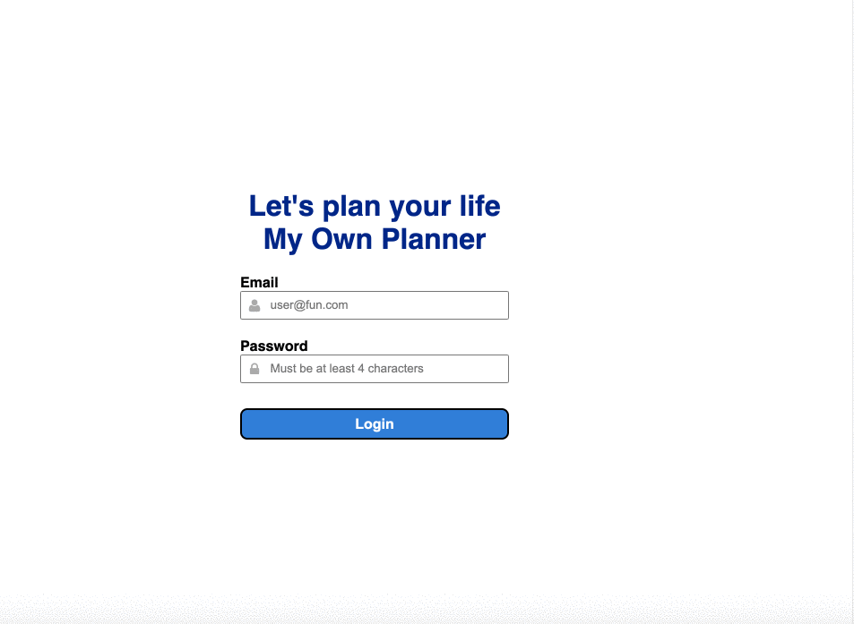

## MyOwnPlanner

Plan your life with this app, simply write down what to do and remind me of things to do.

## Technologies

For this project, I used the following Technologies in my implementation:

- JavaScript
- React, React Hooks
- CSS
- SASS

## Installation

1. run `npm install` in the 'root' directory
2. run `npm run build-prod`
3. run `npm run build-dev`
4. run `npm start`
5. run `npm run sass`
6. find the site on **[localhost:3000](http://localhost:3000/)**
